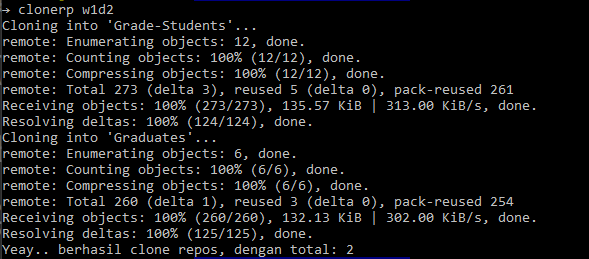

# Clone Repos

## SET-UP

---

1. Koneksikan ssh pc/laptop anda dengan [github](https://docs.github.com/en/github/authenticating-to-github/connecting-to-github-with-ssh).
2. [install jq](https://stedolan.github.io/jq/download/)
3. Buatlah file `.clone_repos.sh` di dalam home directory.

```bash
    cd ~
    touch .clone_repos.sh
```

4. Buka file `.clone_repos.sh` dengan text editor, kemudian masukkan code di bawah ini:

```bash
#!/bin/bash

# silahkan UBAH batch-nya
# contoh: "rmt-010-jersey-fox"
BATCH="rmt-010-jersey-fox"

# silahkan UBAH PATH_REPOS dengan path repos.json yang sudah anda letakkan.
# example "/home/dzakki/repos.json"
PATH_REPOS="/home/dzakki/repos.json"

# REPOSLIST=$(jq -r $WD "$PATH_REPOS")
# echo $REPOSLIST


function clonerp(){

    # WD = WEEK DAY
    WD=".$1"
    REPOSLIST=$(jq -r $WD "$PATH_REPOS")
    if [ -z $1 ]; then
        echo ':: Usage   : clonerp w<week>d<day>'
        printf ":: Example : clonerp w1d2"
        echo
    elif [ $( echo $REPOSLIST | jq 'length') = 0 ]; then
        echo "Week Day yang anda maksud, tidak di temukan. silahkan liat week day di bawah ini:"
        echo $(jq -r '.' "$PATH_REPOS") | jq
    else
        COUNTER=0
        for item in $(echo "${REPOSLIST}" | jq -r '.[] | @text'); do
            git clone "git@github.com:$BATCH/$item.git"
            COUNTER=$[$COUNTER +1]
        done
        echo "Yeay.. berhasil clone repos, dengan total: $COUNTER"
    fi

}
```

Perhatikan, di code tersebut terdapat variable `BATCH` dan `PATH_REPOS` silahkan di ubah sesuai kebutuhan.

5. Load file `.clone_repos.sh` agar perintah clone_repos bisa di jalankan, dengan cara:

   5.1 pergi ke home directory `cd ~` .

   5.2 buka `~/.bashrc` or `~/.zshrc` or `.bash_profile` dengan text editor.

   5.3 masukkan code `source ~/.clone_repos.sh` di paling bawah atau terserah anda.

   5.4 save kemudian close text editor dan juga terminal

6. Buka kembali terminal, kemudian jalankan perintah `clonerp`. jika muncul text seperti di bawah ini:

```bash
:: Usage   : clonerp w<week>d<day>
:: Example : clonerp w1d2
```

Maka clone_repos berhasil di set-up.

## Usage

---

**Jalankan `clonerp` to see guide.** dan akan muncul seperti ini.

```bash
:: Usage   : clonerp w<week>d<day>
:: Example : clonerp w1d2
```

Jika kalian **ingin melihat week-day/`wd` yang tersedia**, bisa jalankan perintah `clonerp wd`. maka akan muncul seperti ini.

```bash
{
  "w1d2": [
    "Grade-Students",
    "Graduates"
  ],
  "w1d3": [
    "Play-With-Strings",
    "Bikilipik-Discount",
    "Gatcha",
    "Laundry-Day",
    "I-Love-Coding",
    "Odd-and-Even-Numbers"
  ],
  "w1d4": [
    "Asterisks",
    "Balik-Kata",
    "Bandingkan-Angka",
    "Konversi-Menit",
    "XO"
  ],
  "w1d5": [
    "Data-Type-Challenge",
    "Hitung-Jumlah-Kata",
    "Palindrome",
    "Palindrome-Angka"
  ],
  "w1d6": [
    "Cross-Pairs",
    "Ubah-Huruf"
  ],
  "w2d2": [
    "Shout-Out",
    "Built-in-Function"
  ],
  "w2d3": [
    "Concat",
    "Interesting-Ladder",
    "Vocal-Seeker",
    "Sitting-Arrangement"
  ],
  "w2d4": [
    "Deret-Geometri",
    "Target-Terdekat",
    "Mengelompokkan-Angka",
    "Game-Checker",
    "Damage-Calculation"
  ],
  "w2d5": [
    "Deep-sum",
    "Most-Frequent-Largest-Numbers",
    "Melee-Ranged",
    "Serial-Validator"
  ],
  "w2d6": [
    "Urutkan-Abjad",
    "Tukar-Ukuran",
    "Sorting"
  ],
  "w3d1": [
    "Change-Me",
    "Count-Me"
  ],
  "w3d4": [
    "TikTok-Viewer",
    "Graduates-Object",
    "Flight-Ticket-Finder",
    "Cari-Median"
  ],
  "w3d5": [
    "Angka-Prima",
    "Cari-Modus"
  ],
  "w4d1": [
    "Web-Sederhana"
  ],
  "w4d3": [
    "To-Do-List"
  ]
}
```

**Untuk clone repos by week and day**, bisa jalankan perintah `clonerp w<week>d<day>` dan pastikan sebelum jalankan perintah tersebut, kalian berada di directory yang kalian ingin kan untuk menyimpan hasil clone repo nya. jika perintah tersebut di jalankan, maka akan muncul seperti ini:



## Contribute

---

Dipersilahkan bosque
